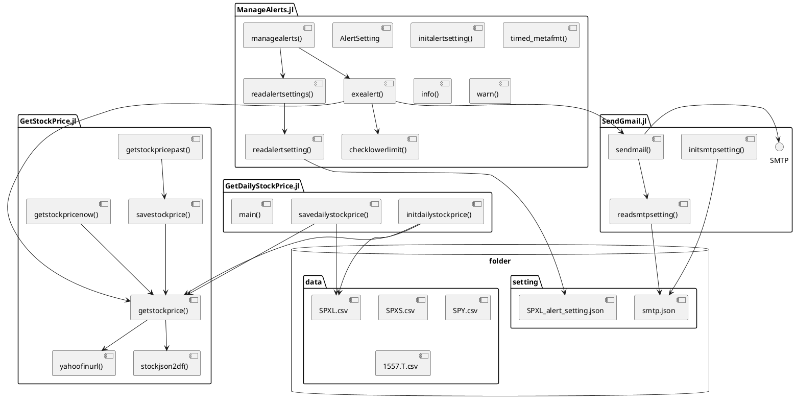

## 株価取得ソフトウエアの設計
### 概要
* 株価データの取得とメールによるアラート通知を行うプログラム．
* GetStockPrices.jl
  - 株価取得の基本機能
* SendGmail.jl
  - メール通知の基本機能．Gmailのみ動作確認．
  - Gmailアカウントの情報を使って，自分宛てに所定の件名・文面のメールを送る
  - あらかじめGmailの設定で安全性の低いアプリを許可しておく
  - `./setting/smtp.json`に以下の情報を記載しておく
    - SMTPサーバURLとポート
    - ユーザー名
    - パスワード
    - 送信者の名前
* GetDailyStockPrice.jl
  - GetStockPrices.jlを使って1分単位の株価をローカルに収集する
  - 1日1回起動する
  - 収集データは`./data/`以下にCSVファイルとして格納される．
  - 取得対象銘柄はmain()で指定
* ManageAlerts.jl
  - アラート通知の管理とアラートロジックを記述
  - 10分に1回株価を取得してアラート判定する．条件に当てはまったらメール通知する
  - `./setting/`以下に`XXXX_alert_setting.json`という名称のアラート別に設定ファイルをおいておくと，起動時に各設定を読み込んで実行する
    - enable: アラート有効/無効
    - alerted: アラートが発されたか．falseにする
    - stock: 監視対象銘柄のティッカー
    - value: 設定値
    - func: アラート対象の関数名
  - 現状は下限値超過の判定のみ実装(checklowerlimit())
  
### モジュール構成
* モジュール構成は以下の通りです
* 表示にはPlantUMLが必要です
